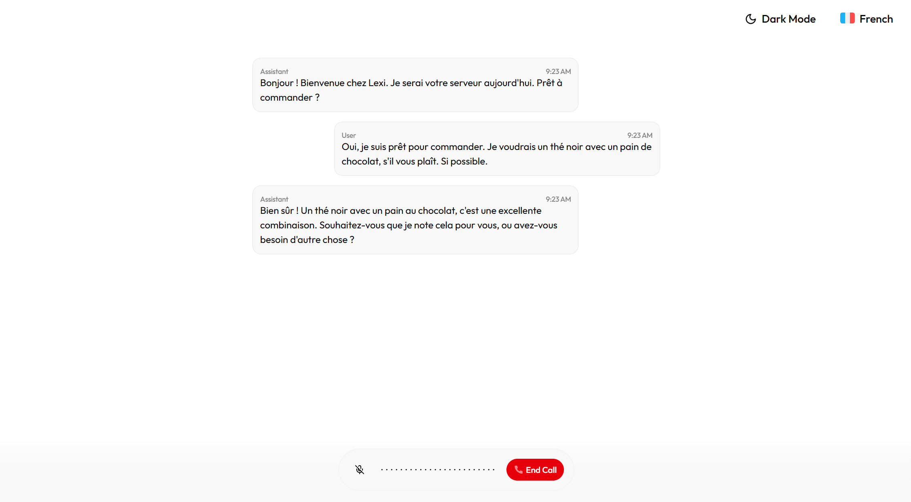
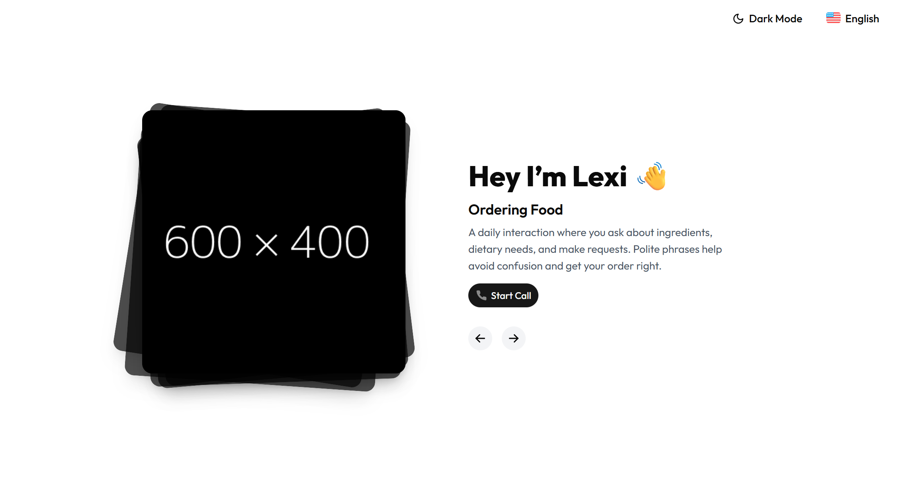

  <h1>Lexi - AI Language Partner</h1>

## Overview

Lexi is an AI-powered language learning companion that helps users practice and improve their English (and other languages) through conversation. With real-time speech recognition, interactive dialogues, and adaptive feedback, Lexi acts as a personal language partner available anytime, anywhere.

## Project Deployment

Click the button below to deploy this project with Vercel:

Below are the steps to complete deployment:

1. Create a Git repository for your project.
2. Provide the required environment variable: `NEXT_PUBLIC_OPENAI_API_KEY`. You can get your API key from OpenAI's [API dashboard](https://platform.openai.com/account/api-keys).
3. Once deployed, open your Vercel URL to start using Lexi as your AI language partner.

## Features

- 🗣️ Real-time voice conversations for language practice
- 💬 Text-based chat with context-aware AI responses
- 🎯 Adaptive learning: Lexi adjusts difficulty based on your level
- 📊 Progress tracking and performance insights
- 🌐 Multi-language support (English, French, etc.)

## Support

If you have questions, need assistance, or want to share feedback, [join our Discord community](https://link.lexi.ai/discord) for discussions and support.
