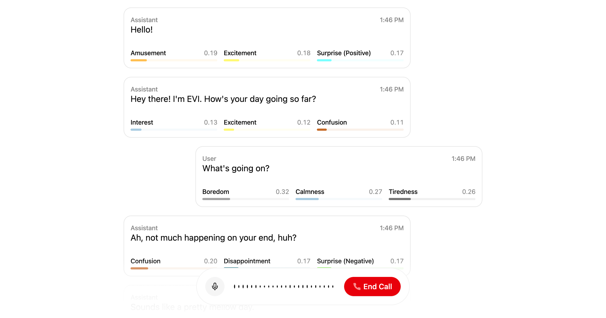

  <h1>OpenAI Voice Chat</h1>
  
Real-time voice conversations with AI

## Overview

This project features a voice chat interface using OpenAI's API for speech-to-text (Whisper), text generation (GPT-4), and text-to-speech (TTS). Built with Next.js App Router for real-time voice conversations.

## Project deployment

Click the button below to deploy this example project with Vercel:

Below are the steps to completing deployment:

1. Create a Git Repository for your project.
2. Provide the required environment variables. To get your API key and Client Secret key, log into the portal and visit the [API keys page](https://beta.hume.ai/settings/keys).

## Support

If you have questions, require assistance, or wish to engage in discussions pertaining to this starter template, [please reach out to us on Discord](https://link.hume.ai/discord).
